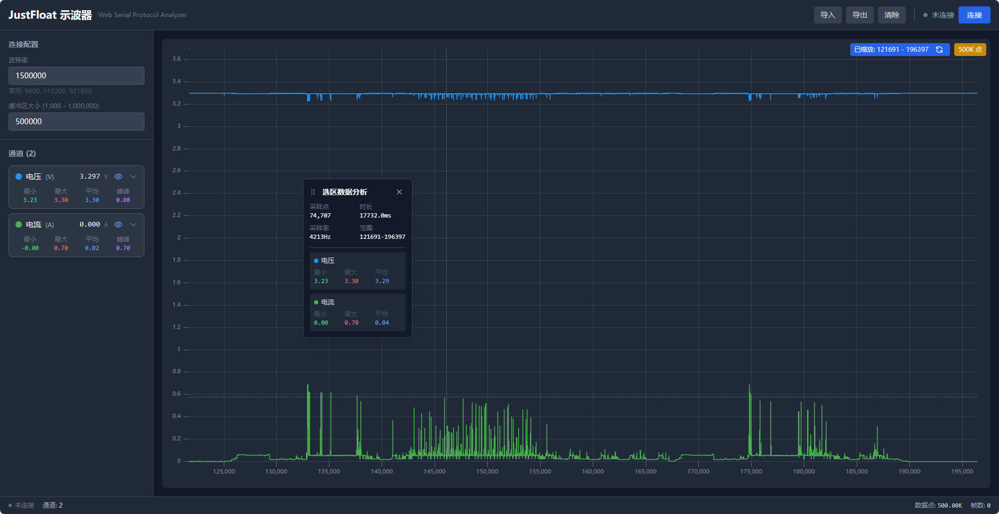

# JustFloat Web 示波器

基于Web的示波器应用，用于实时显示和分析来自JustFloat协议设备的数据。通过Web Serial API与设备通信，解析数据并以图表形式实时展示。



## 功能特性

- 通过串口连接设备并接收数据
- 解析JustFloat协议数据（协议格式：[float ch1, ..., float chN, 0x00, 0x00, 0x80, 0x7F]）
- 实时绘制多通道波形图（最多支持8种颜色区分通道）
- 支持数据导入/导出功能
- 通道配置：可独立设置每个通道的名称、单位、系数和可见性
- 实时显示通道统计数据（最小值、最大值、平均值）
- 可配置的缓冲区大小（最小1000点）
- 支持多种波特率（默认115200）

## 技术栈

- Vue 3 (Composition API)
- TypeScript
- uPlot (图表渲染)
- Tailwind CSS (样式)
- Vite (构建工具)

## 安装和运行

1. 确保已安装Node.js环境

2. 克隆项目：
   ```bash
   git clone https://github.com/createskyblue/justfloat-web-oscilloscope
   ```

3. 进入项目目录并安装依赖：
   ```bash
   cd justfloat-web-oscilloscope
   npm install
   ```

4. 启动开发服务器：
   ```bash
   npm run dev
   ```

## 使用说明

1. 确保浏览器支持Web Serial API（Chrome/Edge推荐）
2. 连接JustFloat协议设备到电脑
3. 打开应用，点击"连接"按钮并选择对应的串口设备
4. 根据需要调整波特率设置
5. 实时查看设备发送的数据波形

## 协议说明

JustFloat协议数据格式为：[float ch1, ..., float chN, 0x00, 0x00, 0x80, 0x7F]

- 数据以4字节为单位的浮点数传输
- 以[0x00, 0x00, 0x80, 0x7F]作为帧同步字
- 解析器使用状态机逐字节解析数据

## 项目结构

```
src/
├── components/          # Vue组件
│   ├── HeaderBar.vue    # 顶部导航栏
│   ├── SidePanel.vue    # 侧边面板
│   ├── OscilloscopeChart.vue # 示波器图表
│   ├── StatusBar.vue    # 状态栏
├── composables/         # Vue组合式API函数
│   ├── useSerial.ts     # 串口通信
│   ├── useProtocolParser.ts # 协议解析
│   ├── useDataBuffer.ts # 数据缓冲
│   ├── useChannelConfig.ts # 通道配置
│   └── useStorage.ts    # 数据存储
├── types/index.ts       # 类型定义
└── utils/helpers.ts     # 工具函数
```
