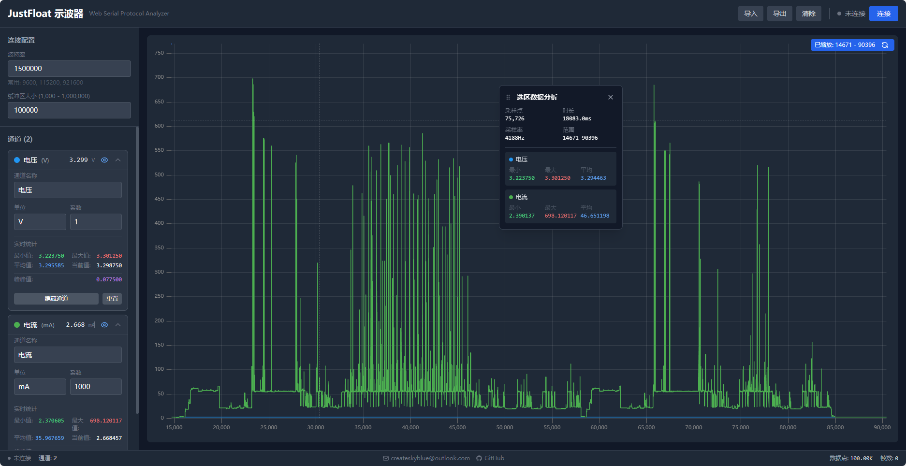
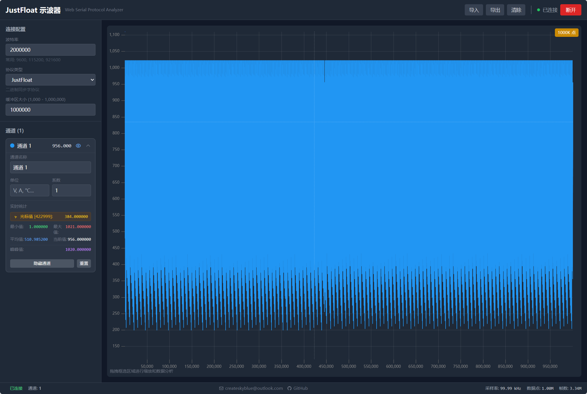
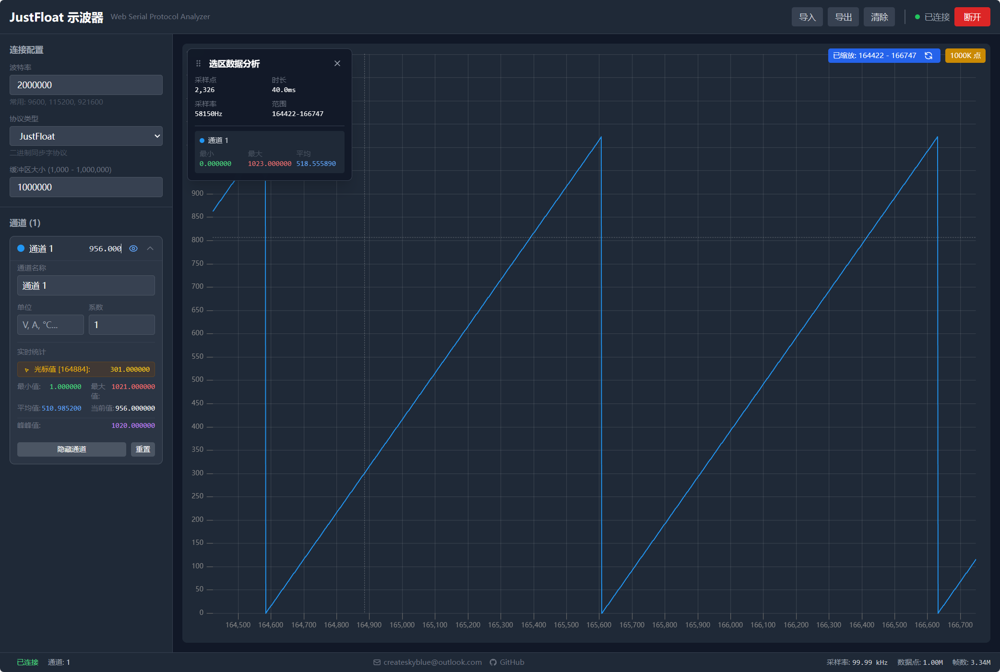
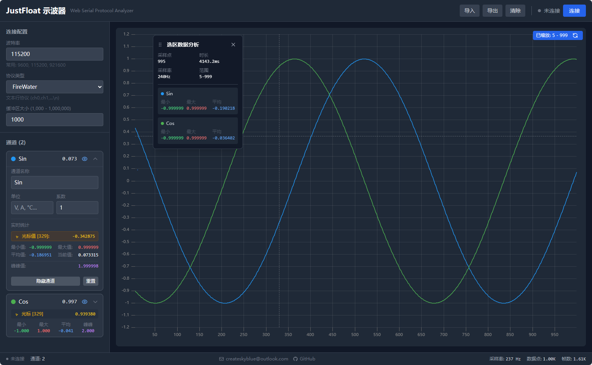

# JustFloat & FireWater Web 协议分析仪

基于Web的示波器应用，用于实时显示和分析来自JustFloat协议和FireWater协议设备的数据。通过Web Serial API与设备通信，解析数据并以图表形式实时展示。






## 功能特性

- 通过串口连接设备并实时接收数据
- 解析JustFloat协议数据（协议格式：[float ch1, ..., float chN, 0x00, 0x00, 0x80, 0x7F]）
- 解析FireWater协议数据（文本格式：<any>:ch0,ch1,ch2,...,chN\\n）
- 支持协议动态切换（JustFloat/FireWater）
- 实时绘制多通道波形图（最多支持8种颜色区分通道）
- 支持数据导入/导出功能（JSON格式）
- 通道配置：可独立设置每个通道的名称、单位、系数和可见性
- 实时显示通道统计数据（最小值、最大值、平均值、当前值）
- 可配置的缓冲区大小（最小1000点，最大1000000点）
- 支持多种波特率（默认115200）
- 性能优化：JustFloat模式下 1个通道 100KSa/s 运行流畅！

## 协议说明

### JustFloat协议
数据格式：[float ch1, ..., float chN, 0x00, 0x00, 0x80, 0x7F]

- 数据以4字节为单位的浮点数传输
- 以[0x00, 0x00, 0x80, 0x7F]作为帧同步字
- 解析器使用状态机逐字节解析数据

### FireWater协议
数据格式：[<any>:]ch0,ch1,ch2,...,chN\\n

- 文本协议，逗号分隔的数值

更多FireWater协议信息请参考：[VOFA+ FireWater协议说明](https://www.vofa.plus/docs/learning/dataengines/firewater)

## 性能特点

- **高采样率支持**：支持高达100KSa/s的采样率
- **高效数据解析**：使用批处理机制提高解析效率
- **智能渲染**：根据数据量和采样率动态调整刷新频率
- **内存管理**：自动限制缓冲区大小，避免内存溢出
- **响应式界面**：使用uPlot图表库实现高性能数据可视化

## 技术栈

- Vue 3 (Composition API)
- TypeScript
- uPlot (高性能图表渲染)
- Tailwind CSS (样式框架)
- Vite (构建工具)

## 安装和运行

1. 确保已安装Node.js环境

2. 克隆项目：
   ```bash
   git clone https://github.com/createskyblue/justfloat-web-oscilloscope
   ```

3. 进入项目目录并安装依赖：
   ```bash
   cd justfloat-web-oscilloscope
   npm install
   ```

4. 启动开发服务器：
   ```bash
   npm run dev
   ```

## 使用说明

1. 确保浏览器支持Web Serial API（Chrome/Edge推荐）
2. 连接设备到电脑
3. 打开应用，选择对应的协议类型（JustFloat或FireWater）
4. 点击"连接设备"按钮并选择对应的串口设备
5. 根据需要调整波特率设置
6. 实时查看设备发送的数据波形
7. 使用鼠标框选功能进行数据区域分析

## 功能操作

- **缩放功能**：在图表上拖拽鼠标创建选区，可以放大查看特定数据段
- **数据统计**：选区后会显示详细的统计数据（采样点数、时长、采样率等）
- **通道控制**：可以在侧边栏单独控制每个通道的显示/隐藏
- **实时光标**：移动鼠标可以查看任意点的具体数值
- **数据导出**：可将当前显示的数据导出为JSON文件

## 项目结构

```
src/
├── components/          # Vue组件
│   ├── HeaderBar.vue    # 顶部导航栏
│   ├── SidePanel.vue    # 侧边面板（含协议选择）
│   ├── OscilloscopeChart.vue # 示波器图表
│   ├── StatusBar.vue    # 状态栏
│   └── ChannelItem.vue  # 通道配置项
├── composables/         # Vue组合式API函数
│   ├── useSerial.ts     # 串口通信
│   ├── useProtocolParser.ts # 协议解析（支持JustFloat和FireWater）
│   ├── useDataBuffer.ts # 数据缓冲
│   ├── useChannelConfig.ts # 通道配置
│   └── useStorage.ts    # 数据存储
├── types/index.ts       # 类型定义
└── utils/helpers.ts     # 工具函数
```
